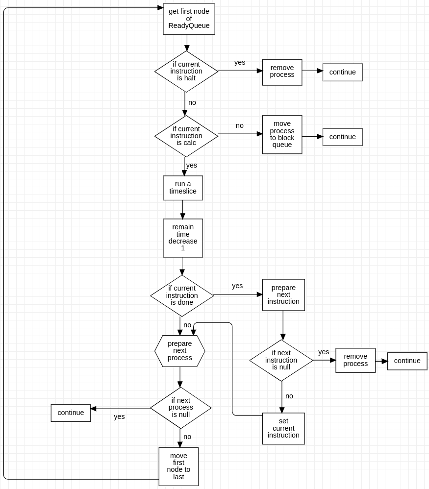
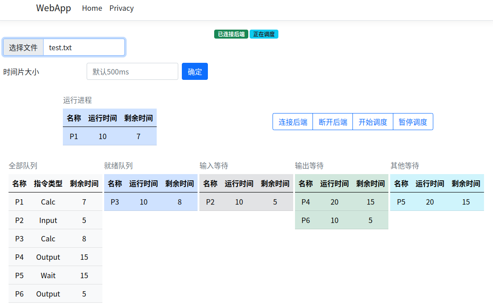

# 轮转法进程调度
## 需求分析
制作一个图形界面应用程序，可以打开一个本地文本文件，读取其中信息转换成进程列表，并对进程进行调度，把调度的情况展现在图形界面。图形界面的制作要考虑跨平台，使其能在 Linux、Windows 平台都能运行。

整个项目应尽量做到低耦合、高内聚，保证系统的灵活性、可维护性、可拓展性，增强代码的重用性。

## 总体设计
C# 作为主要开发语言，使用了 ASP.NET CORE 框架，整体是前后端分离的架构，使用多线程并发模拟 CPU 调度与 I/O 的并行，解决方案的结构如下。
```
RrScheduling 
	├── RobinRound 
	└── WebApp
```
RobinRound 项目为调度算法的类库，主要项目结构如下。
```
RobinRound 
	├── Instruction.cs 
	├── InstructionType.cs 
	├── Pcb.cs 
	└── Scheduling.cs
```
WebApp 为图形界面的实现，基于ASP.NET CORE 框架，为了编程方便，把前端文件和后端服务都放在一个项目里了，主要项目结构如下。
```
WebApp 
	├── Middlewares 
	├── Models 
	├── Pages 
	├── Program.cs 
	└── Services
```
前后端通过 WebSocket 连接交换调度信息，Middlewares 文件夹中放置处理 WebSocket请求的中间件，Models 放置各种处理数据的类，Pages 放置前端网页文件，Services 放置注入框架中的服务（调用进程调度方法的服务）。
## CPU 调度流程图



## 调度界面


